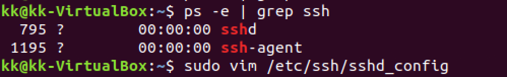

# 无人值守Linux安装镜像制作

## 一. 实验环境

- Virtualbox

- 虚拟机：Ubuntu 18.04 Desktop 64bit
- 主机：Mac

## 二. 实验准备

#### 宿主机通过ssh远程连接虚拟机

- 在 ***设置  > 网络 > 高级 > 端口转发*** 配置以下一条规则：

  

- 打开Mac的 ***系统偏好设置 > 共享***，选中远程登录：

  

- 在Ubuntu 18.04 Desktop虚拟机中，开启ssh服务。

  ```bash
  # 如果没有ssh，按照以下命令安装。
  sudo apt install openssl-server
  
  # 查看ssh是否正确启动
  ps -e | grep ssh
  
  # 编辑ssh配置文件,看Port 22一行命令是否是被注释掉的，如果是，取消注释。
  sudo vim /etc/ssh/sshd_config
  
  # 重启ssh
  service ssh restart
  ```

  

- 在MAC上尝试远程登录。`ssh -p 9022 kk@127.0.0.1`

  

- 成功登陆。

#### ssh免密登录

- 生成密钥对：`ssh-keygen -t rsa`

- 将公钥发送至服务器：```ssh-copy-id kk@127.0.0.1```

- 远程登录：`ssh -p 9022 kk@127.0.0.1`

  

- 可以看到不需要输入密码即可登录成功。

## 三. 实验过程

1. 按「有人值守」方式安装好 **一个可用的 Ubuntu 系统环境（Ubuntu 18.04 Desktop 64bit）**

2. 挂载iso镜像文件。

   ```bash
   # 创建一个用于挂载iso镜像文件的目录
   mkdir mydir1
   
   # 挂载iso镜像文件到该目录
   mount -o loop ubuntu-18.04.1-server-amd64.iso mydir1
   
   # 查看挂载后的文件
   ls
   ```

   

3. 同步光盘内容到目标工作目录

   ```bash
   # 创建一个用于克隆光盘内容的目录
   mkdir copydir
   
   # 同步光盘内容到目标工作目录
   # -v, --verbose increase verbosity，详细模式输出。
   # -a, --archive archive mode；equals -rlptgoD，归档模式，表示以递归方式传输文件，并保持所有文件属性，等于-rlptgoD。
   rsync -av mydir1/ copydir
   
   # 给copydir目录写权限
   chmod +w -R copydir
   
   # 卸载iso镜像
   umount mydir1
   ```

   

4. 构建.seed文件。以官方提供的实例example-preseed.txt为基础进行一定的修改。(使用[文本比对工具](https://www.diffchecker.com/diff)对官方给出的.seed文件和定制的`ubuntu-server-autoinstall.seed`进行比对。)

   - 文本比对工具截图示意：

     

     

   - 在原来的第11行```#d-i localechooser/supported-locales multiselect en_US.UTF-8, nl_NL.UTF-8```后面添加以下两行内容：(目的是为了自动设定语言，在安装过程中跳过选择语言的过程。)

     ```bash
     d-i localechooser/supported-locales multiselect en_US.UTF-8, zh_CN.UTF-8
     d-i pkgsel/install-language-support boolean false
     ```

   - 删除了原来的第34行（```#d-i netcfg/link_wait_timeout string 10```）的注释符号，并将10改为5，以减少等待时间。

   - 删除了原来的第38行（```#d-i netcfg/dhcp_timeout string 60```）的注释符号，并将60改为5，以减少等待时间。

   - 删除了原来的第43行（```#d-i netcfg/disable_autoconfig boolean true```）的注释符号，以禁止自动配置网络。

   - 删除了原来的第54～58行的注释符号，给出IPV4的网络配置。

     ```bash
     d-i netcfg/get_ipaddress string 192.168.1.42
     d-i netcfg/get_netmask string 255.255.255.0
     d-i netcfg/get_gateway string 192.168.1.1
     d-i netcfg/get_nameservers string 192.168.1.1
     d-i netcfg/confirm_static boolean true
     ```

   - 修改了原来的第70，71行内容。将```unassigned-hostname```修改为任意主机名，将```unassigned-domain```修改为任意域名。

     ```bash
     d-i netcfg/get_hostname string Linux
     d-i netcfg/get_domain string dns.sec.cuc.edu.cn
     ```

   - 删除了原来的第76行（```#d-i netcfg/hostname string somehost```）的注释符号，并将```somehost```修改为```ubuntu-host```。这个就是本地主机名，安装系统时会自动设定。

   - 删除了原来的第134，135行的注释符号，并将```Ubuntu user ```修改为```cuc```，将```ubuntu```修改为```cuc```。这创建了一个新用户，安装系统时会自动创建。

     ```bash
     d-i passwd/user-fullname string cuc
     d-i passwd/username string cuc
     ```

   - 删除了原来的第137，138行的注释符号，修改```insecure```用户密码，并再次确认密码。安装时跳过手动输入密码并确定密码的过程。

   - 修改了原来的第160行（```d-i time/zone string US/Eastern```）的```US/Eastern```为```Asia/Shanghai```，同时修改了原来的第163行（```d-i clock-setup/ntp boolean true```）的```true```为```false```，自动设定时区，安装时跳过手动设定。

   - 删除了原来的第184行（```d-i partman-auto/init_automatically_partition select biggest_free```）的注释符号，安装时自动设定分区。

   - 删除了原来的第211行（```d-i partman-auto-lvm/guided_size string max```）的注释符号，安装时自动设定逻辑卷的大小。

   - 修改了原来的第219行（```d-i partman-auto/choose_recipe select atomic```）的```atomic```为```multi```，安装时跳过设定分区策略。

   - 删除了原来的第341行（```d-i apt-setup/use_mirror boolean false```）的注释符号，安装时不使用apt镜像。

   - 修改了原来的第369行（```tasksel tasksel/first multiselect ubuntu-desktop```）的```ubuntu-desktop```为```server```，因为使用的是server版镜像。

   - 删除了原来的第374行（```d-i pkgsel/include string openssh-server build-essential``` ）和第379行（```d-i pkgsel/upgrade select none```）的注释符号，安装时跳过选择需要预安装的软件。

   - 删除了原来的第385行（```d-i pkgsel/update-policy select none```）的注释符号，修改```none```为```unattended-upgrades```，无人值守升级的目的是使计算机始终保持最新的安全（和其他）更新。

   - 保存文件为auto.seed。把它放入```/copyedir/pressed```目录下。

5. 编辑Ubuntu安装引导界面增加一个新菜单项入口。```vim isolinux/txt.cfg```. 「置顶」添加以下内容:

   ```
   label autoinstall
     menu label ^Auto Install Ubuntu Server
     kernel /install/vmlinuz
     append  file=/cdrom/preseed/ubuntu-server-autoinstall.seed debian-installer/locale=en_US console-setup/layoutcode=us keyboard-configuration/layoutcode=us console-setup/ask_detect=false localechooser/translation/warn-light=true localechooser/translation/warn-severe=true initrd=/install/initrd.gz root=/dev/ram rw quiet
   ```

   

6. 修改```isolinux/isolinux.cfg```。将```timeout```改为10。（不需手动按下ENTER启动安装界面）。

   

7. 重新生成校验和。

   ```bash
   # 重新生成md5sum.txt
   find . -type f -print0 | xargs -0 md5sum > md5sum.txt
   ```

8. 返回上一级，打包文件。

   ```bash
   mkisofs -r -V "Custom Ubuntu Install CD" \
               -cache-inodes \
               -J -l -b isolinux/isolinux.bin \
               -c isolinux/boot.cat -no-emul-boot \
               -boot-load-size 4 -boot-info-table \
               -o custom.iso ./copydir/
   ```

9. 此时可以看见已经生成了custom.iso文件。将该文件传回宿主机，新建虚拟机，挂载该iso镜像，发现已经实现「无人值守」安装Ubuntu镜像。

## 四. 实验结果

#### 自动安装示意


## 五. 实验问题

#### Virtualbox安装完Ubuntu之后新添加的网卡如何实现系统开机自动启用和自动获取IP？

- 刚安装好时，可以看到enp0s3的IP地址是`192.168.1.42`，是设定种子时设置的静态IP地址。

  

- `vim /etc/netplan/01-netcfg.yaml`修改网卡属性。

  

  

- `reboot`重启后，再次查看：

  


## 参考文献

1. https://askubuntu.com/questions/806820/how-do-i-create-a-completely-unattended-install-of-ubuntu-desktop-16-04-1-lts
2. https://help.ubuntu.com/lts/installation-guide/example-preseed.txt
3. https://github.com/CUCCS/linux-2019-TheMasterOfMagic/blob/chap0x01/chap0x01/

