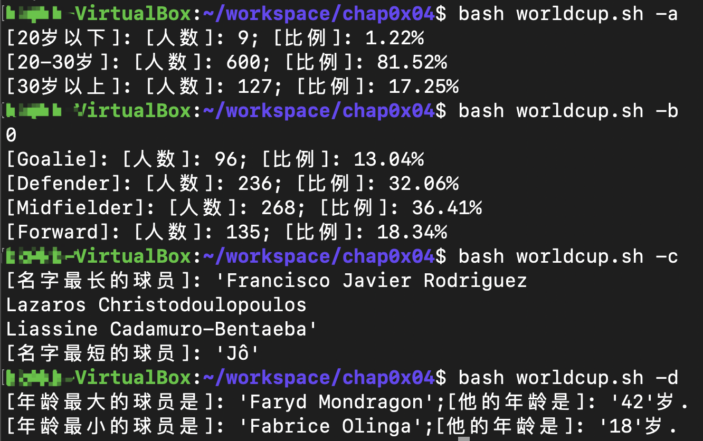
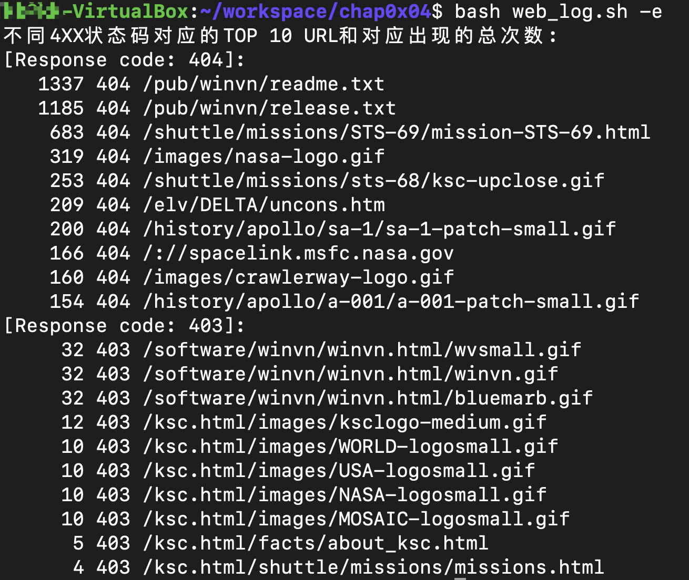

# SHELL脚本编程基础

## 实验目的

- [x] 任务一：用bash编写一个图片批处理脚本，实现以下功能：
  - 支持命令行参数方式使用不同功能
  - 支持对指定目录下所有支持格式的图片文件进行批处理
  - 支持以下常见图片批处理功能的单独使用或组合使用
    - 支持对jpeg格式图片进行图片质量压缩
    - 支持对jpeg/png/svg格式图片在保持原始宽高比的前提下压缩分辨率
    - 支持对图片批量添加自定义文本水印
    - 支持批量重命名（统一添加文件名前缀或后缀，不影响原始文件扩展名）
    - 支持将png/svg图片统一转换为jpg格式图片
- [x] 任务二：用bash编写一个文本批处理脚本，对以下附件分别进行批量处理完成相应的数据统计任务：
  - [2014世界杯运动员数据](https://sec.cuc.edu.cn/huangwei/course/LinuxSysAdmin/exp/chap0x04/worldcupplayerinfo.tsv)
    - 统计不同年龄区间范围（20岁以下、[20-30]、30岁以上）的球员**数量**、**百分比**
    - 统计不同场上位置的球员**数量**、**百分比**
    - 名字最长的球员是谁？名字最短的球员是谁？
    - 年龄最大的球员是谁？年龄最小的球员是谁？
  - [Web服务器访问日志](https://sec.cuc.edu.cn/huangwei/course/LinuxSysAdmin/exp/chap0x04/web_log.tsv.7z)
    - 统计访问来源主机TOP 100和分别对应出现的总次数
    - 统计访问来源主机TOP 100 IP和分别对应出现的总次数
    - 统计最频繁被访问的URL TOP 100
    - 统计不同响应状态码的出现次数和对应百分比
    - 分别统计不同4XX状态码对应的TOP 10 URL和对应出现的总次数
    - 给定URL输出TOP 100访问来源主机

## 实验环境

- Ununtu 18.04

## 准备过程

- 下载[2014世界杯运动员数据](https://sec.cuc.edu.cn/huangwei/course/LinuxSysAdmin/exp/chap0x04/worldcupplayerinfo.tsv)数据。

  ```bash
  wget https://sec.cuc.edu.cn/huangwei/course/LinuxSysAdmin/exp/chap0x04
  /worldcupplayerinfo.tsv
  ```

- 下载[Web服务器访问日志](https://sec.cuc.edu.cn/huangwei/course/LinuxSysAdmin/exp/chap0x04/web_log.tsv.7z)数据。

  ```bash
  # 下载.7z文件
  wget https://sec.cuc.edu.cn/huangwei/course/LinuxSysAdmin/exp/chap0x04/web_log.tsv.7z
  
  # 安装p7zip： 
  sudo apt-get install p7zip
  
  # 解压缩文件： 
  sudo p7zip -d web_log.tsv.7z
  ```

## 实验结果

#### 2014世界杯运动员数据




#### Web服务器访问日志




## 参考

1. [Linux Shell Bash 特殊变量](https://www.cnblogs.com/chjbbs/p/6393805.html)
2. [Linux shell ${}简单用法](https://www.cnblogs.com/xudong-bupt/p/3567096.html)

3. [linux强大的convert命令](https://blog.csdn.net/wonengguwozai/article/details/53122629)