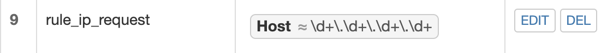

# WEB服务器

## 一. 实验要求

### 基本要求

- [x] 在一台主机（虚拟机）上同时配置Nginx和VeryNginx
  - VeryNginx作为本次实验的Web App的反向代理服务器和WAF
  - PHP-FPM进程的反向代理配置在nginx服务器上，VeryNginx服务器不直接配置Web站点服务
- [x] 使用[Wordpress](https://wordpress.org/)搭建的站点对外提供访问的地址为： http://wp.sec.cuc.edu.cn
- [x] 使用[Damn Vulnerable Web Application (DVWA)](http://www.dvwa.co.uk/)搭建的站点对外提供访问的地址为：http://dvwa.sec.cuc.edu.cn

### 安全加固要求

- [x] 使用IP地址方式均无法访问上述任意站点，并向访客展示自定义的**友好错误提示信息页面-1**

- [x] [Damn Vulnerable Web Application (DVWA)](http://www.dvwa.co.uk/)只允许白名单上的访客来源IP，其他来源的IP访问均向访客展示自定义的**友好错误提示信息页面-2**
- [x] 在不升级Wordpress版本的情况下，通过定制[VeryNginx](https://github.com/alexazhou/VeryNginx)的访问控制策略规则，**热**修复[WordPress < 4.7.1 - Username Enumeration](https://www.exploit-db.com/exploits/41497/)
- [x] 通过配置[VeryNginx](https://github.com/alexazhou/VeryNginx)的Filter规则实现对[Damn Vulnerable Web Application (DVWA)](http://www.dvwa.co.uk/)的SQL注入实验在低安全等级条件下进行防护

### VERYNGINX配置要求

- [x] [VeryNginx](https://github.com/alexazhou/VeryNginx)的Web管理页面仅允许白名单上的访客来源IP，其他来源的IP访问均向访客展示自定义的**友好错误提示信息页面-3**
- [x] 通过定制VeryNginx的访问控制策略规则实现：
  - 限制DVWA站点的单IP访问速率为每秒请求数 < 50
  - 限制Wordpress站点的单IP访问速率为每秒请求数 < 20
  - 超过访问频率限制的请求直接返回自定义**错误提示信息页面-4**
  - 禁止curl访问

## 二. 实验环境

- Ubuntu 18.04 server 虚拟机 （ip：192.168.56.109）配置有

  - Nginx
  - VeryNginx
  - Wordpress
  - Damn Vulnerable Web Application (DVWA)

- mac主机。

- 拓扑结构：

  

## 三. 实验过程

### 基本要求

#### 1. 安装`VeryNginx`

- 安装`VeryNginx` [安装教程](https://github.com/alexazhou/VeryNginx/blob/master/readme_zh.md) ，[Trouble-Shooting](https://github.com/alexazhou/VeryNginx/wiki/Trouble-Shooting)

```bash
# 将VeryNginx仓库克隆到本地
git clone https://github.com/alexazhou/VeryNginx.git

# 进入本地VeryNginx仓库，执行install.py
cd Verynginx
sudo python install.py install  # 失败

# 安装依赖项
sudo apt-get update
sudo apt install libssl1.0-dev
sudo apt-get install libpcre3 libpcre3-dev
sudo apt-get install build-essential
sudo apt-get install zlib1g-dev

# 执行install.py，成功
sudo python install.py install
```

- nginx.conf 中指定了使用 nginx 用户来执行程序，而系统里缺少 nginx 用户. 所以添加`nginx`用户。

  ```bash
  sudo adduser nginx
  ```

- 启动`verynginx`.  

  ```bash
  #启动服务
  /opt/verynginx/openresty/nginx/sbin/nginx
  
  #停止服务
  /opt/verynginx/openresty/nginx/sbin/nginx -s stop
  
  #重启服务
  /opt/verynginx/openresty/nginx/sbin/nginx -s reload
  ```

- 在本地浏览器中访问`http://192.168.56.109/verynginx/index.html`。

  

- 修改配置文件：`/opt/verynginx/openresty/nginx/conf/nginx.conf`

  ```bash
  sudo vim /opt/verynginx/openresty/nginx/conf/nginx.conf
  # 写入
  ssl_certificate /etc/ssl/nginx-selfsigned.crt;
  ssl_certificate_key /etc/ssl/nginx-selfsigned.key;
  ```

#### 2. 安装`Nginx`

```bash
sudo apt-get update
sudo apt install nginx
```

#### 3. 安装WordPress

- 参考[How To Install WordPress with LEMP on Ubuntu 18.04](https://www.digitalocean.com/community/tutorials/how-to-install-wordpress-with-lemp-on-ubuntu-18-04#step-1-%E2%80%94-creating-a-mysql-database-and-user-for-wordpress)进行安装

- 安装并进入`mysql`.

  ```bash
  # 安装mysql
  sudo apt install mysql-server
  
  # 进入mysql
  sudo mysql
  ```

- 新建数据库。

  ```mysql
  # 新建一个wordpress数据库
  mysql> CREATE DATABASE wordpress DEFAULT CHARACTER SET utf8 COLLATE utf8_unicode_ci;
  
  mysql> GRANT ALL ON wordpress.* TO 'wordpressuser'@'localhost' IDENTIFIED BY 'password';
  
  mysql> FLUSH PRIVILEGES;
  
  mysql> exit;
  
  ```

- 重启`mysql`：`sudo systemctl restart mysql`

- 安装php扩展。

  ```bash
  sudo apt install php-curl php-gd php-intl php-mbstring php-soap php-xml php-xmlrpc php-zip
  
  sudo systemctl restart php7.2-fpm
  ```

- 下载Wordpress。

  ```bash
  cd /workspace
  
  curl -LO https://wordpress.org/wordpress-4.7.tar.gz
  
  cp /workspace/wordpress/wp-config-sample.php /workspace/wordpress/wp-config.php
  
  sudo cp -a /workspace/wordpress/. /var/www/html/wordpress
  
  chown -R www-data.www-data /var/www/html/wordpress
  ```

- 修改`wp-config.php` .

  ```php
  define('DB_NAME', 'wordpress');
  
  define('DB_USER', 'wordpressuser');
  
  define('DB_PASSWORD', 'password');
  
  define('FS_METHOD', 'direct');
  ```

- 修改nginx配置文件`/etc/nginx/sites-enabled/default`

  ```
  server {
          listen 8080;
          root /var/www/html/wordpress;
          index index.php index.php index.nginx-debian.php;
          server_name wp.sec.cuc.edu.cn;
          location / {
                  try_files $uri $uri/ =404;
          }
  
          location ~ \.php$ {
                  include snippets/fastcgi-php.conf;
                  fastcgi_pass unix:/var/run/php/php7.2-fpm.sock;
          }
          location ~ /\.ht {
                  deny all;
          }
  }
  ```

- 重启nginx。`sudo systemctl restart nginx`

- 访问`http://wp.sec.cuc.edu.cn:8080`。

  

#### 4. 安装DVWA

- 安装参照[DVWA](https://kifarunix.com/how-to-setup-damn-vulnerable-web-app-lab-on-ubuntu-18-04-server/)

  ```bash
  cd workspace/
  
  sudo git clone https://github.com/ethicalhack3r/DVWA
  
  sudo cp -a ~/workspace/DVWA/ /var/www/html/
  
  cp /var/www/html/DVWA/config/config.inc.php.dist /var/www/html/DVWA/config/config.inc.php
  
  chown -R www-data.www-data /var/www/html/DVWA
  ```

- 参照建立wordpress的方法，新建dvwa数据库。

  ```mysql
  mysql> CREATE DATABASE dvwa DEFAULT CHARACTER SET utf8 COLLATE utf8_unicode_ci;
  mysql> GRANT ALL ON dvwa.* TO 'dvwauser'@'localhost' IDENTIFIED BY 'password';
  mysql> FLUSH PRIVILEGES;
  mysql> exit;
  ```

- 重启`mysql`：`sudo systemctl restart mysql`

- 修改`config.inc.php` .

  ```php
  $_DVWA[ 'db_server' ]   = '127.0.0.1';
  $_DVWA[ 'db_database' ] = 'dvwa';
  $_DVWA[ 'db_user' ]     = 'dvwauser';
  $_DVWA[ 'db_password' ] = 'password';
  ```

- 编辑`/etc/php/7.2/fpm/php.ini`. 保存之后重启php。`sudo systemctl restart php7.2-fpm`

  ```ini
  allow_url_include = on
  allow_url_fopen = on
  safe_mode = off 
  magic_quotes_gpc = off 
  display_errors = off
  ```

- 修改nginx配置文件`/etc/nginx/sites-enabled/default`，添加以下：

  ```
  server {
      listen 5566; 
      root /var/www/html/DVWA;
      index index.php index.php index.nginx-debian.php;
      server_name dvwa.sec.cuc.edu.cn;
      location / {
              try_files $uri $uri/ =404;
      }
      location ~ \.php$ {
              include snippets/fastcgi-php.conf;
              fastcgi_pass unix:/run/php/php7.2-fpm.sock;
      } 
  }
  ```

- 重启nginx。`sudo systemctl restart nginx`

- 访问`http://dvwa.sec.cuc.edu.cn:9080`,登录

  

**VeryNginx 配置反向代理**

- 打开 `config > Basic > Matcher` ,在**Request Matcher** 里添加以下规则：

  

- 在Proxy Pass中添加以下规则。

  

**PHP-FPM进程的反向代理配置在nginx服务器上，VeryNginx服务器不直接配置Web站点服务**

- 在nginx配置文件`/etc/nginx/sites-enabled/default` 中写入：

```php
location ~ \.php$ {
            include snippets/fastcgi-php.conf;
            fastcgi_pass unix:/run/php/php7.2-fpm.sock;
    }
```

### 安全加固要求

**使用IP地址方式均无法访问上述任意站点，并向访客展示自定义的友好错误提示信息页面-1**

- 在**Request Matcher** 里添加以下规则

  

- 在**Reponse**中添加以下规则

  

- 在**Filter**中添加以下规则

  

- 测试结果。

  

**DVWA只允许白名单上的访客来源IP，其他来源的IP访问均向访客展示自定义的友好错误提示信息页面-2**

- 在**Request Matcher** 里添加以下规则

  

- 在**Reponse**中添加以下规则

  

- 在**Filter**中添加以下规则

  

- 测试结果。

  

**在不升级Wordpress版本的情况下，通过定制VeryNginx的访问控制策略规则，热修复WordPress < 4.7.1 - Username Enumeration**

- 在**Request Matcher** 里添加以下规则

  

- 在**Reponse**中添加以下规则

  

- 在**Filter**中添加以下规则

  

- 测试结果。

  

**通过配置VeryNginx的Filter规则实现对Damn Vulnerable Web Application (DVWA)的SQL注入实验在低安全等级条件下进行防护**

- 在**Request Matcher** 里添加以下规则

  

- 在**Reponse**里添加以下规则

  

- 在**Filter** 里添加以下规则

  

- 测试结果

  - 匹配前：

    

  - 匹配后：

    

### Verynginx配置要求

**VeryNginx的Web管理页面仅允许白名单上的访客来源IP，其他来源的IP访问均向访客展示自定义的友好错误提示信息页面-3**

- 在**Request Matcher** 里添加以下规则

  

- 在**Reponse**里添加以下规则

  

- 在**Filter**里添加以下规则

  

- 测试结果

  

**通过定制VeryNginx的访问控制策略规则实现：**

- 限制DVWA站点的单IP访问速率为每秒请求数 < 50

- 限制Wordpress站点的单IP访问速率为每秒请求数 < 20

  - 在**Frequency Limit**中添加以下规则

    

  - 测试结果

    

    

- 超过访问频率限制的请求直接返回自定义错误提示信息页面-4：`curl http://wp.sec.cuc.edu.cn/?[1-25]`

  

- 禁止curl访问

  - 在**Request Matcher** 里添加以下规则

    

  - 在**Response** 里添加以下规则

    

  

  - 在**Filter** 里添加以下规则

    

   - 测试结果

     

## 四. 参考

1. [FLYFLY-H实验报告五](https://github.com/CUCCS/linux-2019-FLYFLY-H/blob/linux_exp5/exp5/实验报告五.md)
2. [jckling实验报告五](https://github.com/CUCCS/linux-2019-jckling/blob/0x05/0x05/实验报告.md)